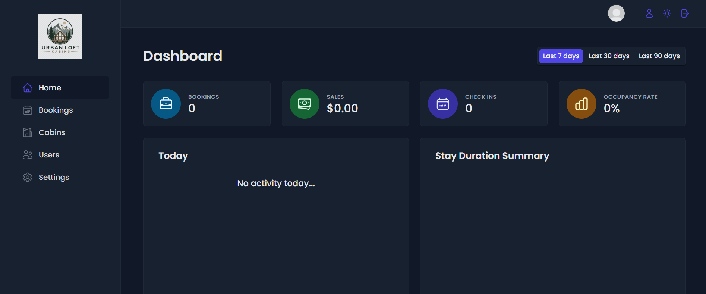
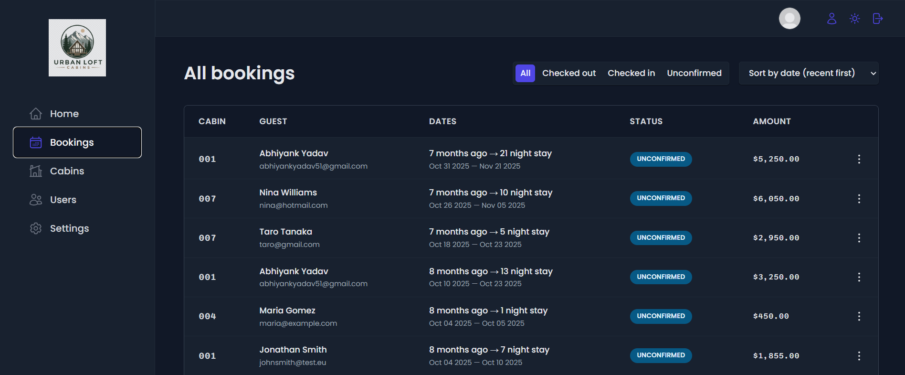
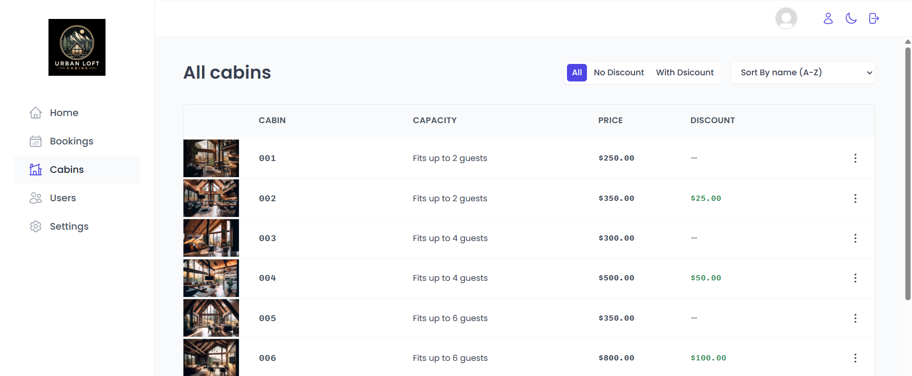
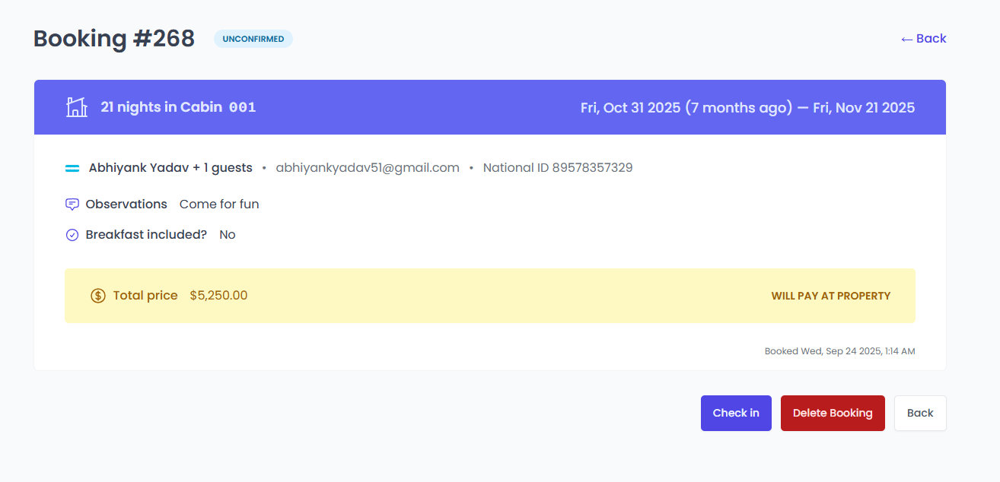
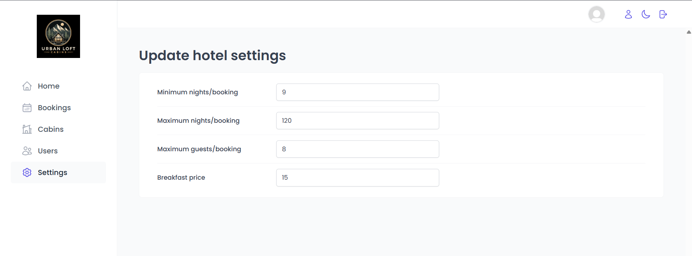
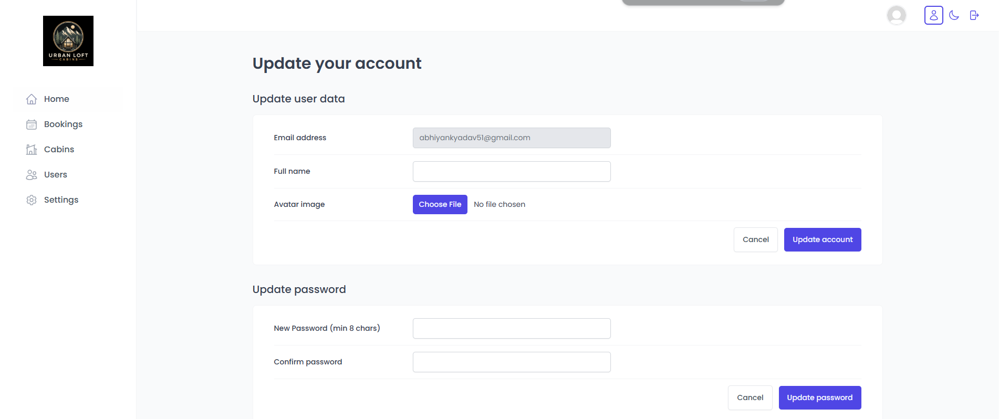

# The Urban Loft Company — Admin Dashboard

A modern hotel management admin dashboard built with React, Supabase, React Query, and styled-components. The application helps hotel staff manage bookings, cabins, guests, check-ins/check-outs, dashboard analytics, user accounts, and application settings from one centralized interface.

---

| Dashboard Page | Bookings Page |
|---|---|
|  |  |

| Cabins Page | Booking Details Page |
|---|---|
|  |  |

| Settings Page | Account Page |
|---|---|
|  |  |

---

## Features

- Secure authentication and protected admin routes
- Dashboard with recent bookings, sales analytics, stay duration charts, and today’s activity
- Booking management with filtering, sorting, detailed booking view, check-in, and check-out flow
- Cabin management with create, edit, duplicate, delete, filter, and sort functionality
- User creation and account management
- Hotel settings management for booking rules, guest limits, and breakfast pricing
- Dark mode support with persistent user preference
- Server-state management and caching using React Query
- Toast notifications for user feedback
- Responsive, component-based UI built with styled-components

---

## Tech Stack

| Category | Technology |
| --- | --- |
| Frontend | React, Vite |
| Routing | React Router DOM |
| Backend / Database | Supabase |
| Server State | TanStack React Query |
| Forms | React Hook Form |
| Charts | Recharts |
| Styling | styled-components |
| Notifications | React Hot Toast |
| Icons | React Icons |
| Date Utilities | date-fns |

---

## Project Structure

```bash
src/
├── context/              # Dark mode context
├── data/                 # Sample data and cabin assets
├── features/             # Feature-based modules
│   ├── authentication/   # Login, logout, signup, user account logic
│   ├── bookings/         # Booking list, details, filters, actions
│   ├── cabins/           # Cabin CRUD operations
│   ├── check-in-out/     # Check-in and checkout workflow
│   ├── dashboard/        # Stats, charts, and activity dashboard
│   └── settings/         # Hotel settings update form
├── hooks/                # Reusable custom hooks
├── pages/                # Route pages
├── services/             # Supabase API services
├── styles/               # Global styles
├── ui/                   # Reusable UI components
└── utils/                # Helper functions and constants
```

---

## Getting Started

### 1. Clone the repository

```bash
git clone https://github.com/your-username/the-wild-oasis.git
cd the-wild-oasis
```

### 2. Install dependencies

```bash
npm install
```

### 3. Configure environment variables

Create a `.env` file in the root directory:

```env
VITE_SUPABASE_URL=your_supabase_project_url
VITE_SUPABASE_ANON_KEY=your_supabase_anon_key
```

### 4. Start the development server

```bash
npm run dev
```

### 5. Build for production

```bash
npm run build
```

---

## Available Scripts

| Command | Description |
| --- | --- |
| `npm run dev` | Starts the local development server |
| `npm run build` | Builds the app for production |
| `npm run preview` | Previews the production build locally |
| `npm run lint` | Runs ESLint checks |

---

## Environment Variables

| Variable | Description |
| --- | --- |
| `VITE_SUPABASE_URL` | Supabase project URL |
| `VITE_SUPABASE_ANON_KEY` | Supabase public anonymous key |

---

## Main Pages

- **Dashboard** — Overview of sales, bookings, stays, occupancy, and today’s activity
- **Bookings** — View, filter, sort, and manage all hotel bookings
- **Booking Details** — Detailed guest, booking, payment, and stay information
- **Check In** — Confirm guest arrival and update booking status
- **Cabins** — Manage hotel cabin records and pricing
- **Users** — Create new admin users
- **Settings** — Update hotel booking rules and pricing settings
- **Account** — Update user profile, avatar, and password

---

## 📧 **Contact**  
For any queries, suggestions, or contributions, feel free to reach out:  
- **Email:** [abhiyankyadav51@gmail.com](abhiyankyadav51@gmail.com)  

---

## 📜 **License**  
This project is licensed under the [MIT License](LICENSE).  

